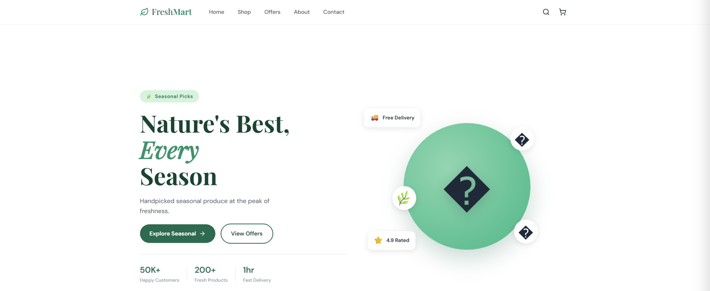
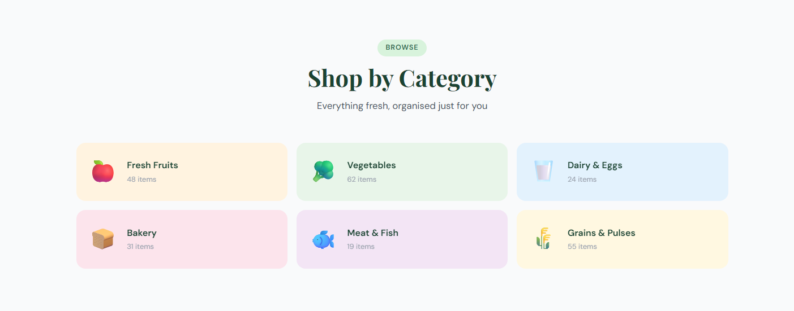
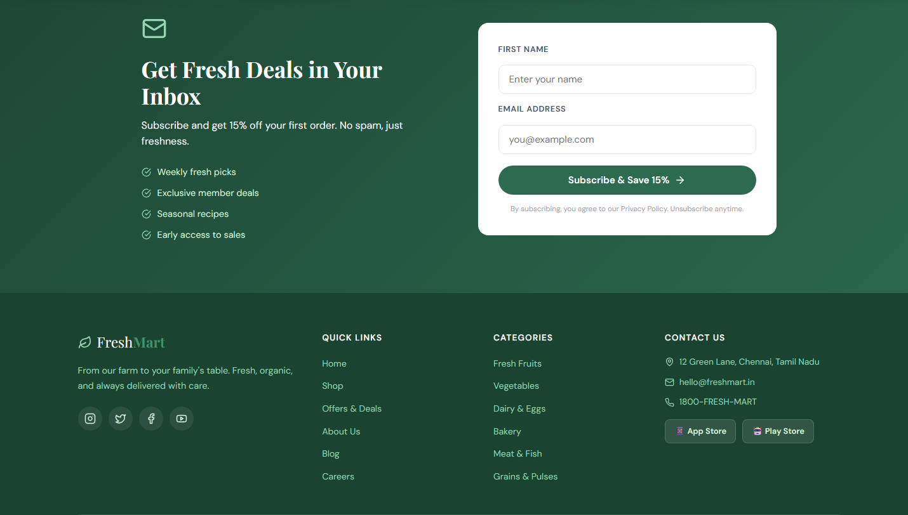
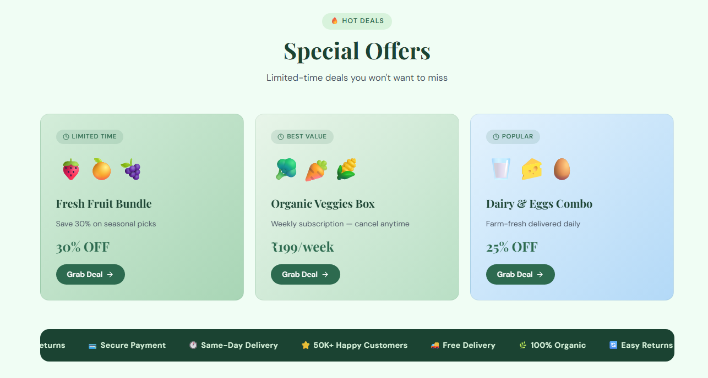

# Grocery App

A modern grocery shopping web application built with React.

## Features

- Browse grocery products
- Search for items
- Add products to cart
- Responsive UI
- Fast and clean user experience

## Screenshots

### Home


### Categories


### Contact


### Special Offers


## Tech Stack

- React
- JavaScript
- HTML5
- CSS3

## Installation

Clone the repository

```bash
git clone https://github.com/<your-username>/grocery-app.git
```

Go to the project folder

```bash
cd grocery-app
```

Install dependencies

```bash
npm install
```

Start the development server

```bash
npm start
```

The app will run at:

```
http://localhost:3000
```

## Project Structure

```
src/
public/
package.json
```

## Future Improvements

- User Authentication
- Backend Integration
- Payment Gateway
- Order History
- Wishlist

## License

This project is for learning purposes.
